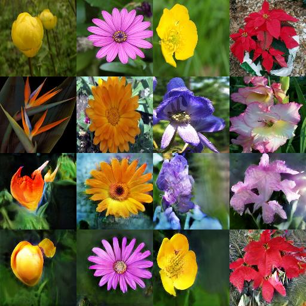
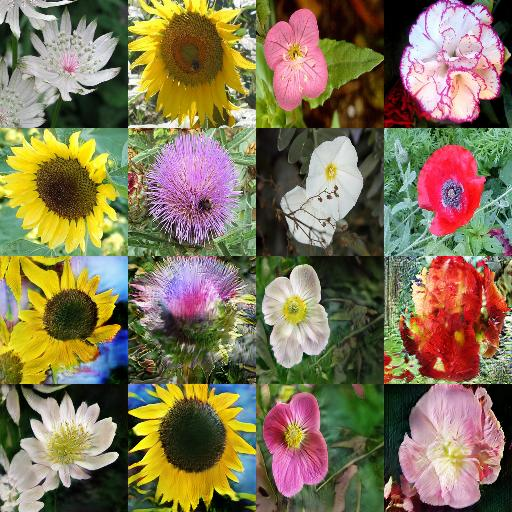
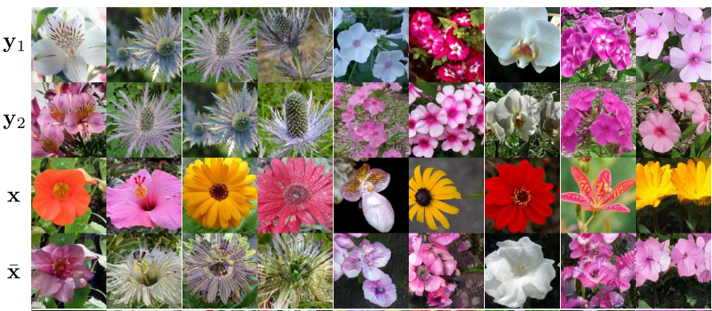

# FUNIT_tensorflow
Tensorflow Implementation of FUNIT: Few-Shot Unsupervised Image-to-Image Translation

<p align="center">  </p>

--------------------------------------------
[Original Paper](https://arxiv.org/abs/1905.01723) | [Original Pytorch Code](https://github.com/NVlabs/FUNIT)

## Dependencies

* [Python 3.6](https://www.python.org/download/releases/3.6/)
* [Tensorflow 1.13](https://github.com/tensorflow/tensorflow)
* [numpy](http://www.numpy.org/)

## Usage

- Clone this repo:
  ```bash
  git clone https://github.com/zhangqianhui/FUNIT_tensorflow.git
  ```
- Download the Flowers dataset

  Download Flowers dataset from [VGG Linking](http://www.robots.ox.ac.uk/~vgg/data/flowers/102/102flowers.tgz) and [label](http://www.robots.ox.ac.uk/~vgg/data/flowers/102/imagelabels.mat).
  
  ```bash
  cd your_path
  unzip 102flowers.tgz
  ```
  
-Usage
```
├── Dataset Path
     ├── jpg
         ├── xxx.jpg 
         ├── yyy.png
         ├── ...
     ├── imagelabels.mat

```
  
- Train this model using Flowders dataset
  
  ```bash
  python train.py --data_dir PATH --num_source_class 70
  ```
- Test
  ```bash
  python test.py 
  ```


## Our results

- Results on Flowers dataset (1-4 rows is: x, y, results, recon)

<p align="center"> </p>
 
- Paper results

<p align="center"> /p>


# Reference code

- [Gazecorrection](https://github.com/zhangqianhui/GazeCorrection)

- [FUNIT pytorch](https://github.com/NVlabs/FUNIT)

- [AttGAN_tensorflow](https://github.com/LynnHo/AttGAN-Tensorflow)


